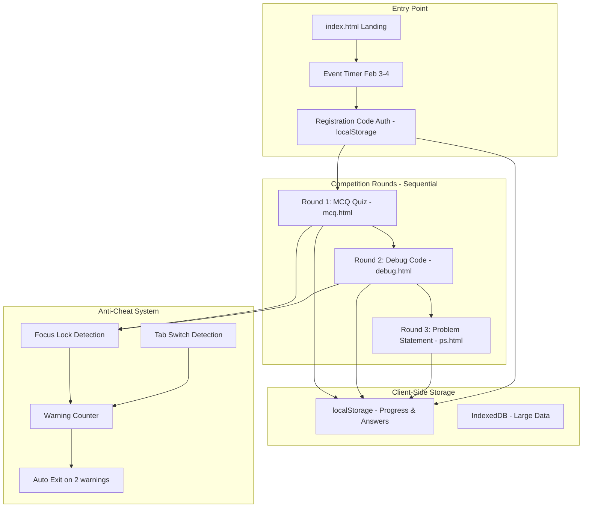

---
name: CodeWar Competition Platform
overview: Build a complete client-side CodeWar competition system with MCQ quiz, Debug code, and Problem Statement rounds featuring anti-cheat mechanisms, timer countdown, and sequential round progression using HTML, CSS, and JavaScript only (no PHP).
todos:
  - id: setup-structure
    content: Create codewar/ folder structure and convert existing MCQ text files to JSON format
    status: in_progress
  - id: auth-system
    content: Build client-side registration code authentication with localStorage
    status: pending
  - id: landing-page
    content: Create CodeWar landing page (HTML) with Feb 3-4 countdown timer and round navigation
    status: pending
  - id: anti-cheat
    content: Implement anti-cheat JS module (focus lock, tab detection, warnings, shortcuts blocking)
    status: pending
  - id: mcq-round
    content: Build MCQ quiz (HTML) with language selection, randomization, 30-min timer, auto-submit
    status: pending
  - id: debug-round
    content: Create Debug round (HTML) with code editor and client-side solution verification
    status: pending
  - id: ps-round
    content: Build Problem Statement round (HTML) with client-side test case verification
    status: pending
  - id: storage-system
    content: Implement localStorage/IndexedDB for progress tracking and score persistence
    status: pending
  - id: results-page
    content: Create results page (HTML) showing scores and completion status
    status: pending
---
# CodeWar Competition Platform

## Architecture Overview



## File Structure

```
codewar/
├── index.html             # Landing page with timer + round selection
├── mcq.html               # MCQ Quiz round
├── debug.html             # Debug Code round
├── ps.html                # Problem Statement round
├── results.html           # Results & scores display
├── js/
│   ├── auth.js            # Client-side authentication & localStorage
│   ├── anti_cheat.js      # Focus lock, tab detection, warnings
│   ├── timer.js           # Quiz timer functionality
│   ├── storage.js         # localStorage/IndexedDB wrapper
│   ├── code_verifier.js   # Client-side test case verification for PS
│   └── utils.js           # Utility functions
├── css/
│   └── codewar.css        # Competition-specific styles
└── data/
    ├── mcq/               # MCQ questions JSON per language
    ├── debug/             # Debug questions JSON per language
    └── ps/                # Problem statements + test cases
```

## Key Implementation Details

### 1. Event Timer (Feb 3-4, 2026)

- Countdown timer on landing page showing days/hours/minutes until event
- Competition accessible only during event dates (client-side date check)
- Total competition duration: 2-3 hours max

### 2. Authentication Flow

- Participant enters unique registration code
- Code validated client-side (simple format validation or predefined list in JS)
- localStorage stores: registration_code, language_choice, current_round, warnings, scores
- No server-side validation required (offline-first approach)

### 3. MCQ Round (30 questions, 30 min)

- Language selection screen (C, C++, Java, Python) - locked after 2 changes
- Questions loaded from JSON files via fetch API, randomized using Fisher-Yates shuffle
- 30 random questions served per participant
- Timer auto-submits when time expires
- Progress saved to localStorage to prevent data loss
- Answers stored in localStorage with auto-save on selection

### 4. Debug Round

- Same language as MCQ (locked from localStorage)
- Display faulty code + editable solution panel
- Client-side verification against correct solution stored in JSON
- Same anti-cheat as MCQ
- Solutions saved to localStorage

### 5. Problem Statement Round

- Single coding problem displayed
- Solution textarea with syntax highlighting (optional, using CodeMirror or Prism)
- Client-side test case verification:
  - Run code in Web Worker or eval (with sandboxing) against pre-defined test cases
  - Show pass/fail for each test case
  - Display time/space complexity estimation (manual or basic analysis)
- NO focus lock (participants can use external IDE)
- Solutions saved to localStorage

### 6. Anti-Cheat Mechanisms

| Mechanism | MCQ | Debug | PS |
|-----------|-----|-------|-----|
| Focus Lock (blur detection) | Yes | Yes | No |
| Tab Switch Detection | Yes | Yes | Yes |
| Warning Counter (max 2) | Yes | Yes | No |
| Auto Exit on 3rd violation | Yes | Yes | No |

**Additional Cheat Prevention:**

- Disable right-click context menu
- Disable copy/paste in question area
- Disable keyboard shortcuts (Ctrl+C, Ctrl+V, F12, etc.)
- Disable text selection on questions
- Full-screen mode enforcement
- Browser back button disabled

### 7. Client-Side Storage Schema

**localStorage Keys:**
- `codewar_registration_code` - Participant registration code
- `codewar_language_choice` - Selected language (c, cpp, java, python)
- `codewar_language_changes` - Number of language changes (max 2)
- `codewar_current_round` - Current round (not_started, mcq, debug, ps, completed)
- `codewar_warnings` - Number of warnings (max 2)
- `codewar_tab_switches` - Number of tab switches
- `codewar_mcq_answers` - JSON object of MCQ answers {questionId: answer}
- `codewar_mcq_score` - MCQ score and percentage
- `codewar_debug_answers` - JSON object of debug solutions
- `codewar_debug_score` - Debug score and percentage
- `codewar_ps_solutions` - JSON object of PS solutions
- `codewar_ps_score` - PS score
- `codewar_started_at` - Competition start timestamp
- `codewar_completed_at` - Competition completion timestamp
- `codewar_timer_mcq` - MCQ timer remaining seconds
- `codewar_timer_debug` - Debug timer remaining seconds
- `codewar_timer_ps` - PS timer remaining seconds

**IndexedDB (Optional for large data):**
- Store full question sets if needed
- Store submission history
- Store detailed analytics

## Styling

- Consistent with existing dark theme (`#050b1a` background)
- Cyan accent (`#00bfff`) for interactive elements
- Red warning indicators for anti-cheat alerts
- Timer with pulsing animation when < 5 minutes remaining

## Files to Modify

- [`codewar.php`](codewar.php) - Update to link to new HTML pages
- [`assets/css/style.css`](assets/css/style.css) - Add competition-specific styles (or create separate codewar.css)

## Files to Create

- `codewar/index.html` - Landing page with timer and authentication
- `codewar/mcq.html` - MCQ quiz round
- `codewar/debug.html` - Debug code round
- `codewar/ps.html` - Problem statement round
- `codewar/results.html` - Results display page
- `codewar/js/auth.js` - Client-side authentication and localStorage management
- `codewar/js/storage.js` - localStorage/IndexedDB wrapper utilities
- `codewar/js/anti_cheat.js` - Anti-cheat JavaScript module
- `codewar/js/timer.js` - Quiz timer functionality
- `codewar/js/code_verifier.js` - Client-side code execution and test case verification
- `codewar/js/utils.js` - Utility functions
- `codewar/css/codewar.css` - Competition-specific styles
- `codewar/start_server.bat` - One-click Windows batch script to start server and open browser
- `codewar/start_server.ps1` - PowerShell alternative script for server startup
- `codewar/START_SERVER.md` - Documentation for server start scripts
- `.gitignore` - Git ignore file for Python, IDE, OS, and temporary files
- JSON question banks from existing text files (already exist in data/)

## Files to Remove (PHP Code)

- `codewar/index.php` - Replace with index.html
- `codewar/auth.php` - Replace with js/auth.js
- `codewar/mcq.php` - Replace with mcq.html
- `codewar/debug.php` - Replace with debug.html
- `codewar/ps.php` - Replace with ps.html
- `codewar/results.php` - Replace with results.html
- `codewar/includes/config.php` - Remove (use JS constants)
- `codewar/includes/db_helper.php` - Remove (use localStorage)
- `codewar/api/*.php` - Remove all API endpoints (use client-side logic)
- `codewar/admin_reset.php` - Remove or convert to JS if needed
